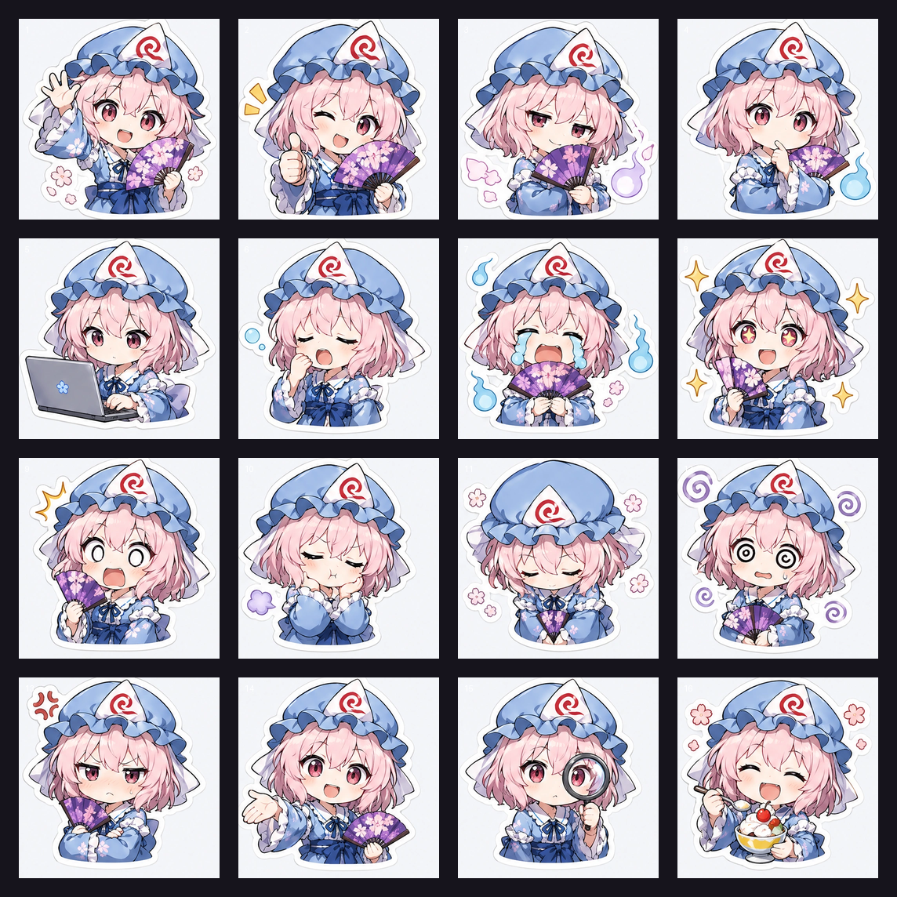
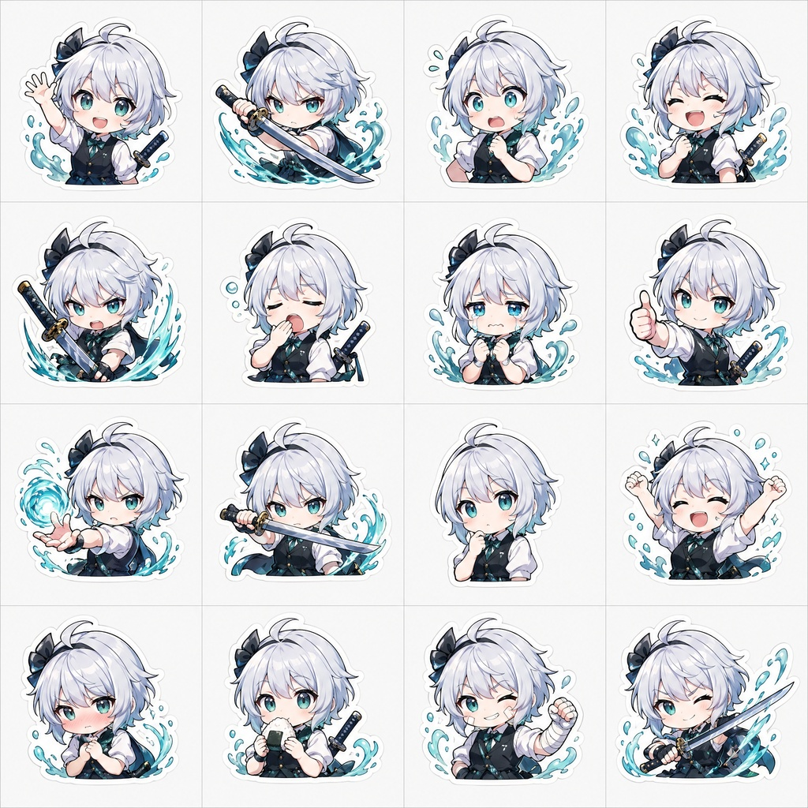
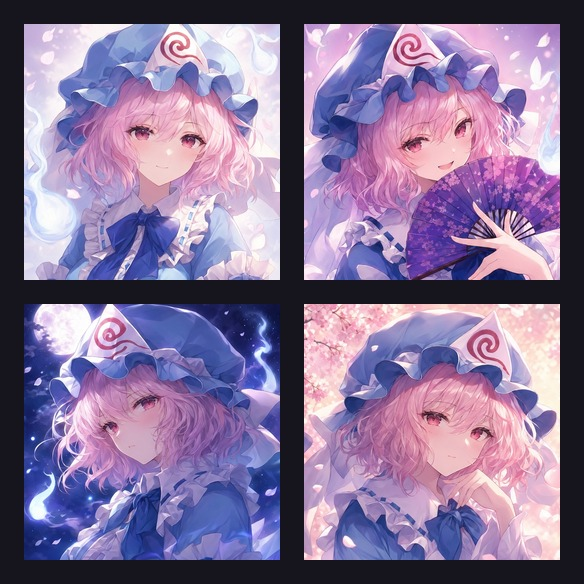
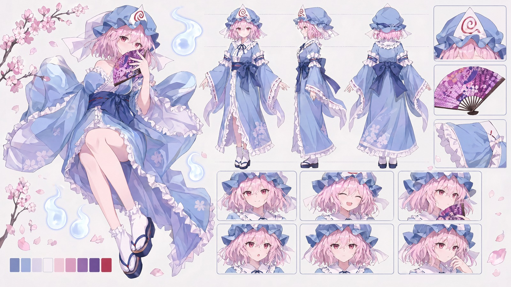
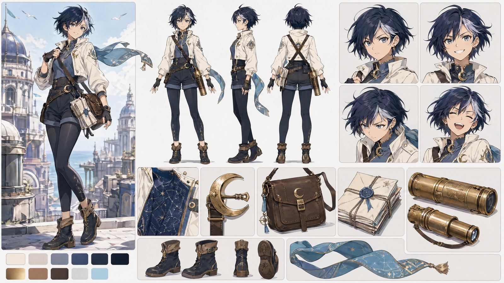

# Image Generation Skills Bundle

Image Generation Skills is an OpenClaw bundle for production-minded image workflows: generate the creative draft, then use deterministic scripts for review, export, packaging, and handoff.

It is built for stickers, avatars, character sheets, brand marks, visual QA, and source-backed identity locking. The bundle does not pretend image generation is deterministic; it makes the non-deterministic step explicit and keeps final files reproducible.

## What it can do

- Lock an existing/anime/game/fandom character identity before generation.
- Generate coherent Telegram-style sticker sheets and export 512px WebPs deterministically.
- Create square avatar/profile variants from a locked persona or character.
- Produce reusable character reference sheets and PDF dossiers.
- Explore logos/app icons/brand marks, then finalize geometry through deterministic SVG/raster QA.
- Review generated visual artifacts for identity, provider fallback, text, layout, crop, and delivery risk.

## Core workflow

```text
source / brief / reference image
  → identity lock when needed
  → explicit provider + size request
  → generated draft or contact sheet
  → visual-review-gate
  → deterministic export / PDF / manifest / package
```

The model creates drafts and art plates. Scripts create the final truth: split grids, icon sizes, rendered SVGs, QA reports, PDF dossiers, ZIPs, and manifests.

## Skills map

| Need | Skill |
|---|---|
| Identify and lock a known/fandom-looking character | `character-source-lock` |
| Review generated visual output before delivery | `visual-review-gate` |
| Sticker/reaction packs | `persona-sticker-pack` |
| Profile/avatar variants | `avatar-variant-studio` |
| Character reference sheets and dossiers | `character-sheet-studio` |
| Logos, app icons, favicons, compact brand marks | `brand-mark-studio` |

`shared/` contains common generation policy, output checks, manifests, routing rules, and deterministic scripts. It is required support, but it is not an installable skill.

## Routing quick reference

- Existing/fandom-looking subject identity uncertain → `character-source-lock` first.
- Sticker/reaction sheet → `persona-sticker-pack` → `visual-review-gate` → deterministic grid export.
- Profile/avatar variants → `avatar-variant-studio` → deterministic square exports.
- Character reference/style bible → `character-sheet-studio` → deterministic PDF dossier.
- Logo/app icon/brand mark → `brand-mark-studio` → deterministic vector/raster QA.
- Final QA before delivery → `visual-review-gate`.

## Design philosophy

- **Provider proof matters.** Production runs should record requested model, returned model, dimensions, and fallback status.
- **Generated text is risky.** Keep readable text out of generated art; add it deterministically when it matters.
- **Identity is separate from style.** Identity references control the subject; style references control crop, outline, scale, mood, and composition.
- **Accept before export.** Do not split, package, or publish a generated sheet until visual QA accepts it.
- **Final artifacts should be repeatable.** Grid splits, icon exports, SVG renders, PDFs, and ZIPs are deterministic wherever possible.

## Curated examples

Representative accepted outputs are kept under `examples/`. Preview images are embedded so the README is useful on GitHub without opening folders.

### Sticker pack — Yuyuko



- Folder: `examples/persona-sticker-yuyuko/`
- Shows: source lock → `openai/gpt-image-2` 2048×2048 4×4 sheet → visual QA → deterministic 512 WebP export.
- Files: `preview.png`, `stickers-webp.zip`, `source_lock.md`, `run_manifest.json`.

### Sticker pack — Youmu



- Folder: `examples/persona-sticker-youmu/`
- Shows: accepted direct 4×4 sticker workflow from a prior run.
- Files: `preview.jpg`, `stickers-webp.zip`.

### Avatar variants — Yuyuko



- Folder: `examples/avatar-yuyuko/`
- Shows: 2×2 `openai/gpt-image-2` 2048×2048 avatar sheet → deterministic 512/1024 exports.
- Files: `preview.jpg`, `avatar-bundle.zip`, `run_manifest.json`.

### Character sheet — Yuyuko



- Folder: `examples/character-sheet-yuyuko/`
- Shows: source lock → 3840×2160 art-only sheet → visual QA → deterministic 2-page PDF dossier.
- Files: `preview.jpg`, `brief.md`, `dossier.pdf`, `run_manifest.json`.

### Character sheet — Starlit Courier



- Folder: `examples/character-sheet-starlit-courier/`
- Shows: accepted 3840×2160 character-sheet/PDF workflow.
- Files: `preview.jpg`, `brief.md`, `dossier.pdf`.

## Shared scripts

| Script | Purpose |
|---|---|
| `shared/scripts/export_contact_sheet_grid.py` | Split 2×2 or 4×4 sheets into deterministic image/WebP exports, manifests, and ZIPs. |
| `shared/scripts/export_icon_pack.py` | Export common app/web icon sizes from one square source. |
| `shared/scripts/make_before_after.py` | Create simple before/after comparison images. |
| `shared/scripts/render_svg_to_png.sh` | Render SVGs to PNG for QA and handoff. |
| `shared/scripts/logo_qa.sh` | Render/diff/optimize logo SVGs against a raster draft. |
| `shared/scripts/trace_png_to_svg.mjs` | Optional raster-to-SVG tracing helper. |

## Sticker style assets

`persona-sticker-pack/assets/style-examples/` contains compact style-only references. Use them for crop, outline, scale, expression grammar, and gutters only — not identity or exact poses.

Good starting points:

- `good-white-halo-4x4.png`
- `good-red-4x4.jpg`
- `good-blonde-4x4.jpg`
- `good-white-sword-4x4.jpg`
- `generic-sticker-style-grid-768.png`

## Install into Orin

From this repo:

```bash
SRC=$PWD
DST=/path/to/openclaw/workspace/skills
for d in character-source-lock visual-review-gate persona-sticker-pack avatar-variant-studio character-sheet-studio brand-mark-studio shared; do
  rm -rf "$DST/$d"
  cp -a "$SRC/$d" "$DST/$d"
done
openclaw skills check
```

Expected ready skills:

- `character-source-lock`
- `visual-review-gate`
- `persona-sticker-pack`
- `avatar-variant-studio`
- `character-sheet-studio`
- `brand-mark-studio`

## Validation

Minimum local validation after edits:

```bash
python3 -m py_compile \
  shared/scripts/export_contact_sheet_grid.py \
  shared/scripts/export_icon_pack.py \
  character-sheet-studio/scripts/build_character_dossier_pdf.py
openclaw skills check
```

For production generation tests, include provider proof, actual dimensions, QA verdict, and artifact paths in a run manifest.

## Archive policy

The production bundle stays lean. Bulky, rejected, or transient test runs should be archived outside the installable bundle.

Do not copy archive contents back into active skills unless a specific file becomes a curated example or style asset.
